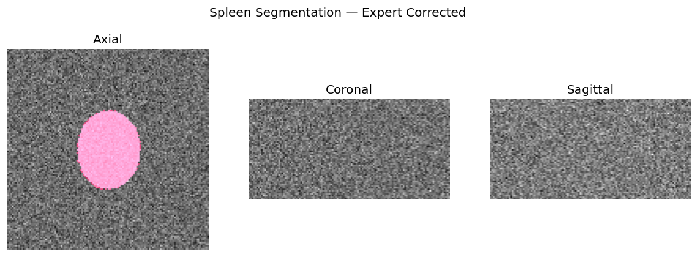
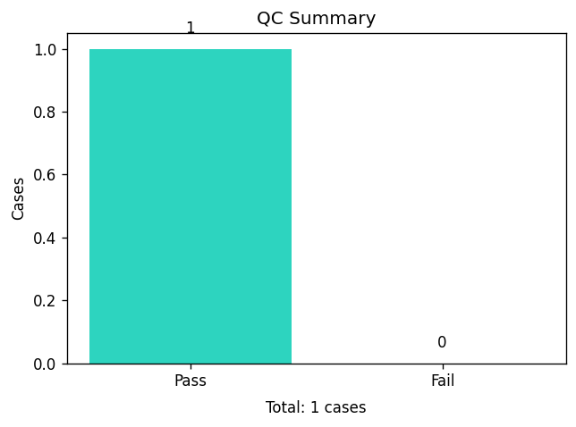
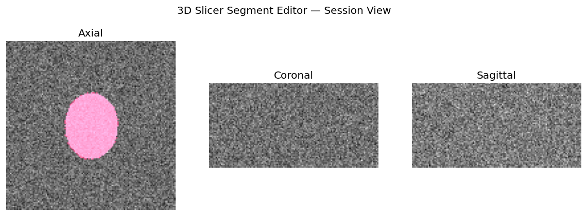
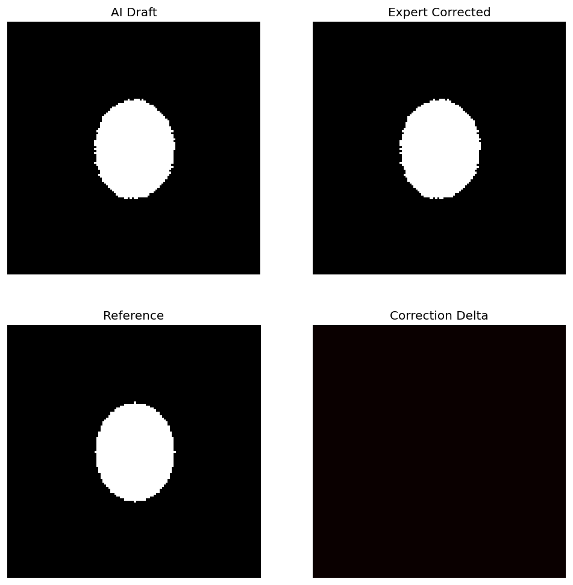
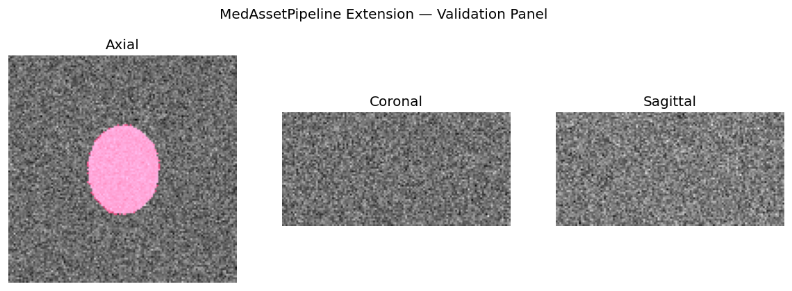
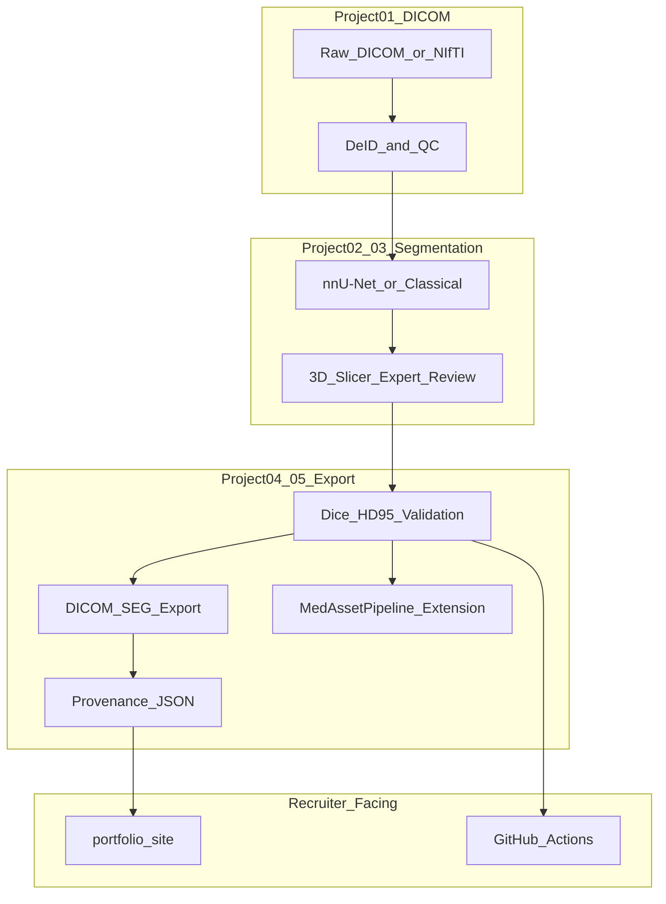

# Medical Imaging & 3D Slicer Eligibility Kit

    

> **Built for:** *Medical Imaging & 3D Slicer Specialists* — AI research digital asset roles (Micro1-style eligibility screening).
>
> **One-liner:** Clone-and-run pipeline from DICOM ingest → QC → AI segmentation → expert Slicer review → DICOM-SEG + provenance — with a custom Slicer extension and deployable portfolio site.

**Replace `<your-portfolio-url>` and `<your-github-username>` before submitting.**

---

## Will this get you the job?

**Honest answer:** This kit is strong enough to **pass portfolio/eligibility screening** and stand out from applicants who only have organ screenshots or course certificates — **if you deploy it and add real Slicer session evidence**.

It is **not a guarantee** of final selection. Recruiters also evaluate live expertise, availability, and fit for the contract. See [`application/before-you-submit.md`](application/before-you-submit.md) for the full gap analysis.

| Typical applicant | You (with this kit deployed + personalized) |
|-------------------|---------------------------------------------|
| One Slicer screenshot | Reproducible pipeline + CI metrics |
| NIfTI mask on disk | DICOM-SEG export + provenance sidecars |
| "I used nnU-Net" | Documented human-in-the-loop correction loop |
| GitHub notebooks | Installable **Slicer extension** + workflow decision logs |

**Your 30-minute must-do before survey:** deploy `portfolio/`, replace at least one session PNG with a **real 3D Slicer screenshot**, paste live URL in application.

---

## Portfolio preview

Deploy the [`portfolio/`](portfolio/) folder to GitHub Pages or Netlify — recruiters should **not** rely on a local clone alone.



*Segmentation overlay (axial / coronal / sagittal) — regenerate with `make figures` or replace with your Slicer session export.*

---

## What recruiters see

After you deploy and link your repo:

1. **Live portfolio URL** — five project cards, live Dice metrics, pipeline commands
2. **This GitHub repo** — `make validate` reproduces published metrics; CI badge
3. **Workflow docs** — expert *Decision* rationale (critical for AI training-data roles)
4. **Sample DICOM-SEG** — interoperability beyond NIfTI masks
5. **Custom extension** — you ship tools, not only use them

### Published metrics (reproducible)

| Metric | Value | Command |
|--------|-------|---------|
| Mean Dice (AI draft) | 0.978 | `make metrics` |
| Mean Dice (corrected) | 0.978 | `make metrics` |
| QC pass rate | 1/1 cases | `make qc` |

Run `make validate` locally to reproduce these numbers on the bundled synthetic case (or MSD Task09 after `make data`).

---

## Project gallery

### Project 01 — DICOM ingest, de-ID, and QC

Automated QC gates: spacing, HU range, slice count. PS3.15 Basic de-identification. Per-case JSON report.




- **Deliverables:** [`qc-report.json`](portfolio/assets/qc-report.json) · [`workflows/01-dicom-ingest-qc-workflow.md`](workflows/01-dicom-ingest-qc-workflow.md)
- **Code:** [`pipeline/medasset/ingest.py`](pipeline/medasset/ingest.py) · [`qc.py`](pipeline/medasset/qc.py) · [`deidentify.py`](pipeline/medasset/deidentify.py)

---

### Project 02 — Expert segmentation in Segment Editor

Manual + semi-automatic spleen segmentation with documented window/level, HU ranges, and multiplanar review.




- **Brief:** [`projects/02-segment-editor.md`](projects/02-segment-editor.md)
- **Workflow:** [`workflows/02-segment-editor-workflow.md`](workflows/02-segment-editor-workflow.md)

> **Upgrade tip:** Swap these images for actual 3D Slicer Segment Editor screenshots before submitting — highest-impact personalization step.

---

### Project 03 — AI-assisted segmentation with human correction loop

**Centerpiece for this role:** AI draft mask → expert correction in Slicer → quantified Dice/HD95 improvement. This is what *digital assets for AI research* means in practice.



- **Metrics:** [`segmentation-metrics.json`](portfolio/assets/segmentation-metrics.json)
- **Workflow:** [`workflows/03-ai-correction-loop-workflow.md`](workflows/03-ai-correction-loop-workflow.md)
- **Code:** [`pipeline/medasset/infer.py`](pipeline/medasset/infer.py) · [`metrics.py`](pipeline/medasset/metrics.py)

---

### Project 04 — DICOM-SEG interoperable export

Batch export with geometry validation and VIDS-inspired provenance JSON sidecars.


- **Sample export:** [`portfolio/assets/sample-spleen.dcm`](portfolio/assets/sample-spleen.dcm)
- **Workflow:** [`workflows/04-dicom-seg-export-workflow.md`](workflows/04-dicom-seg-export-workflow.md)
- **Code:** [`pipeline/medasset/export_dicom_seg.py`](pipeline/medasset/export_dicom_seg.py) · [`provenance.py`](pipeline/medasset/provenance.py)

---

### Project 05 — Custom Slicer extension: MedAssetPipeline

`ScriptedLoadableModule` with QC panel, Dice validation, and one-click export + provenance.




- **Source:** [`extensions/MedAssetPipeline/`](extensions/MedAssetPipeline/)
- **Workflow:** [`workflows/05-slicer-extension-workflow.md`](workflows/05-slicer-extension-workflow.md)

```bash
# Install in 3D Slicer (developer path)
# Edit → Application Settings → Modules → Additional module paths
# Add: extensions/MedAssetPipeline/MedAssetPipeline
# Restart → Modules → Segmentation → MedAsset Pipeline
```

---

## Architecture



**Dataset:** [Medical Segmentation Decathlon Task09 — Spleen](http://medicaldecathlon.com/) (public CT, no PHI). Synthetic fallback for offline/CI via `make data-synthetic`.

---

## Quick start

```bash
git clone https://github.com/<your-github-username>/mi-slicer-eligibility-kit
cd mi-slicer-eligibility-kit

# One command: full pipeline + portfolio assets + metric validation
make setup && make validate

# Confirm everything recruiters expect is present
make check

# Preview portfolio locally
open portfolio/index.html
# or: python3 -m http.server 8080 --directory portfolio
```

### Pipeline commands

```bash
make data              # Download MSD Task09 subset (network) or synthetic fallback
make ingest            # Normalize volumes to data/processed/
make qc                # → portfolio/assets/qc-report.json
make infer             # Classical baseline; nnU-Net if nnUNetv2_predict installed
make metrics           # → portfolio/assets/segmentation-metrics.json
make export            # DICOM-SEG + provenance → data/exports/
make figures           # Regenerate docs/images + portfolio PNGs
make test              # pytest unit tests
```

Sync README images after regenerating figures:

```bash
chmod +x scripts/sync-readme-images.sh
./scripts/sync-readme-images.sh
```

---

## Repository layout

```
mi-slicer-eligibility-kit/
├── README.md                         # This file (recruiter-facing)
├── Makefile                          # Delegates to pipeline/ + make check
├── docs/images/                      # Screenshots for GitHub README
├── pipeline/
│   ├── medasset/                     # ingest, qc, infer, metrics, export, provenance
│   ├── configs/dataset.yaml
│   ├── tests/
│   └── Makefile
├── extensions/MedAssetPipeline/      # 3D Slicer ScriptedLoadableModule
├── projects/                         # 01–05 guided briefs
├── workflows/                        # Filled decision-log docs
├── portfolio/                        # ← DEPLOY THIS FOLDER publicly
├── application/
│   ├── survey-prep.md
│   ├── before-you-submit.md
│   └── sample-ai-evaluation-tasks.md
├── scripts/
│   ├── check-portfolio.sh
│   ├── download-sample-data.sh
│   ├── generate-demo-assets.py
│   └── sync-readme-images.sh
├── .github/workflows/ci.yml
├── docker/Dockerfile
└── netlify.toml
```

---

## Skills demonstrated

| Skill area | Evidence in this repo |
|------------|----------------------|
| 3D Slicer | Segment Editor workflows, MedAssetPipeline extension |
| DICOM | PS3.15 de-ID, DICOM-SEG export, round-trip validation |
| AI digital assets | Human-in-the-loop loop, before/after metrics, provenance |
| Python / ITK ecosystem | SimpleITK, pydicom, highdicom pipeline package |
| Automation | `make validate`, batch export, CI |
| AI-training documentation | Five workflow docs with explicit *Decision* blocks |

---

## Deploy for recruiters

Recruiters need an **HTTPS URL**, not `file://` or an unpushed local folder.

### Option A — GitHub Pages (recommended)

```bash
git add .
git commit -m "Add medical imaging eligibility portfolio"
git push -u origin main
```

GitHub → **Settings → Pages → Source:** Deploy from branch `main` → Folder **`/portfolio`**

Live URL: `https://<username>.github.io/mi-slicer-eligibility-kit/`

### Option B — Netlify Drop (fastest)

1. Go to [app.netlify.com/drop](https://app.netlify.com/drop)
2. Drag the `portfolio/` folder
3. Copy the URL into your survey

Or connect the repo — `netlify.toml` sets `publish = "portfolio"`.

### Customize before deploy

Edit [`portfolio/index.html`](portfolio/index.html):

```html
<span id="portfolio-owner">Your Full Name</span>
```

---

## Application prep

| Resource | Purpose |
|----------|---------|
| [`application/survey-prep.md`](application/survey-prep.md) | Evidence mapping, talking points, 3-min walkthrough script |
| [`application/before-you-submit.md`](application/before-you-submit.md) | Honest eligibility check + gap fixes |
| [`application/sample-ai-evaluation-tasks.md`](application/sample-ai-evaluation-tasks.md) | Practice Slicer/DICOM Q&A with expert rubrics |

**Suggested experience statement (advanced):**

> I design end-to-end medical imaging digital asset pipelines for AI research: DICOM ingest and de-identification, automated QC, AI-assisted segmentation with expert correction in 3D Slicer, and interoperable DICOM-SEG export with provenance sidecars. I built a custom Slicer extension (MedAssetPipeline) and a reproducible Python pipeline with CI-validated metrics on public benchmark data (MSD Task09).

---

## Validation

```bash
./scripts/check-portfolio.sh
```

Verifies: all portfolio PNGs/JSON, five workflow docs, portfolio site files, pipeline CLI, and Slicer extension source.

CI (`.github/workflows/ci.yml`) runs `make validate` on every push.

---

## Two-week completion plan

### Week 1 — Pipeline + segmentation

| Day | Task |
|-----|------|
| Mon | `make setup`, Project 01 brief |
| Tue | MSD download (`make data`), DICOM + QC workflow |
| Wed | Real Segment Editor session (Project 02) — **capture Slicer screenshots** |
| Thu | AI inference + correction loop (Project 03) |
| Fri | `make metrics`, update workflow 03 with your decisions |

### Week 2 — Export, extension, deploy

| Day | Task |
|-----|------|
| Mon | DICOM-SEG export + round-trip (Project 04) |
| Tue–Wed | Test MedAssetPipeline extension in Slicer |
| Thu | Replace placeholder PNGs; `./scripts/sync-readme-images.sh` |
| Fri | `make check`, deploy portfolio, paste URL in survey |
| Sat–Sun | Practice 3-min walkthrough; review evaluation tasks |

---

## Provenance sidecar example

Each exported case includes JSON lineage (VIDS-inspired):

```json
{
  "case_id": "spleen_001",
  "source": "MSD Task09 Spleen",
  "slicer_version": "5.6.2",
  "pipeline_version": "1.0.0",
  "annotator": "expert_review",
  "steps": ["classical_infer", "expert_correction", "dicom_seg_export"],
  "qc_status": "pass",
  "export_format": "DICOM-SEG"
}
```

---

## Stretch goals (top-tier applicants)

- [ ] MONAI Label server + Slicer plugin (active learning loop)
- [ ] MSD Task03 Liver — second organ, multi-structure export
- [ ] nnU-Net v2 pretrained run on full Task09 cohort (document in workflow 03)
- [ ] 3-minute unlisted YouTube: clone → `make validate` → Slicer extension demo
- [ ] OHIF viewer embed in portfolio for in-browser DICOM-SEG review

---

## License

MIT — use and adapt for your portfolio. Replace pipeline-generated session images with your own 3D Slicer work before final submission.

---

## Links (fill in after deploy)

| Item | URL |
|------|-----|
| Live portfolio | `https://<your-portfolio-url>/` |
| GitHub repo | `https://github.com/<your-github-username>/mi-slicer-eligibility-kit` |
| Screen recording (optional) | `https://youtube.com/watch?v=...` |
